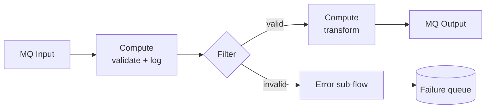
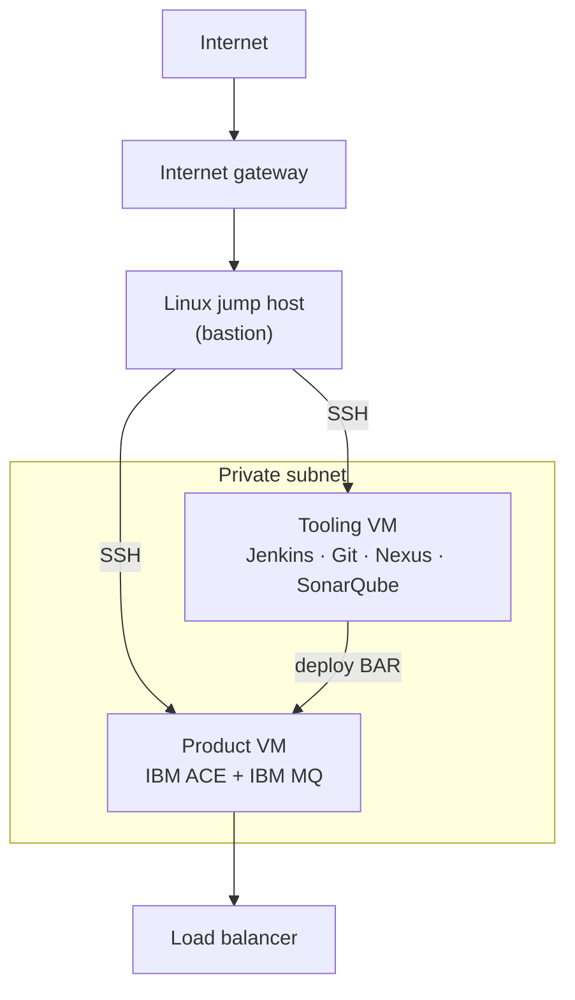
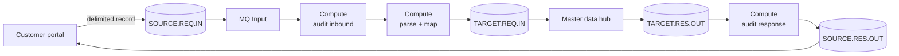
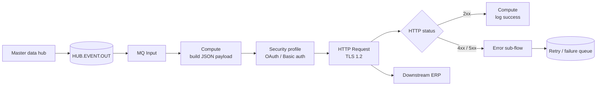

> **A note on detail.** This describes patterns and my own working practice from an
> enterprise engagement. System names, queue names, hostnames, endpoints, and
> credentials are generalised or replaced with placeholders, and all code below is
> representative of the patterns I used rather than client source. Nothing
> proprietary appears here.

## The context

I worked on the integration layer of a large enterprise platform. At the centre
sat a **Master Data Management (MDM) hub** — the golden copy of customer and
vendor records. Around it sat everything that needed to read or write that data:
a customer-facing portal, an upstream provisioning system, an ERP, a CRM, and a
data lake feeding analytics.

None of those systems talked to each other directly. **IBM App Connect
Enterprise (ACE)** sat in the middle as the integration bus: receiving messages,
validating and transforming them, routing them to the right target, and handing
back a response. Over three years I built and ran roughly fifty of these
integrations.

This page walks through **one inbound flow and one outbound flow** end to end,
then the platform work around them — security, deployment, monitoring, and the
v11 → v12 migration I led.

---

## First: what a message flow actually is

If you haven't worked with ACE, the vocabulary is the main barrier. It's simpler
than it sounds.

An **integration node** (historically "broker") is the runtime process. Inside
it are **integration servers** (historically "execution groups") — isolated
containers for your applications. You deploy **applications** into an
integration server, and an application contains one or more **message flows**.

A message flow is a directed graph of **nodes**. Each node does one job, and a
message travels along the wires between them:

- **Input nodes** start the flow — `MQ Input`, `HTTP Input`, `File Input`, `Timer`
- **Compute nodes** transform the message, written in **ESQL** or Java
- **Filter / Route nodes** make branching decisions
- **Request nodes** call something external — `HTTP Request`, `SOAP Request`
- **Output nodes** end the flow — `MQ Output`, `File Output`, `HTTP Reply`

A **sub-flow** is a reusable fragment you drop into many flows — error handling,
audit logging, header manipulation. Building those once mattered: it's the
difference between fifty flows that each handle failures slightly differently
and fifty flows that behave identically when something breaks.



The **message tree** is the other core idea. When a message arrives, ACE parses
it into a tree with distinct branches: `Root` for the message body,
`Properties`, `LocalEnvironment` for flow-scoped scratch data, and
`ExceptionList` for errors. ESQL is the language for walking and rewriting that
tree.

---

## Where it ran

The platform ran on Linux VMs inside a cloud VPC, split across public and
private subnets. Nothing in the private subnet was reachable from the internet —
all access went through a bastion host.



The same topology was replicated across **DEV, UAT, and Production**. Integration
servers were split by transport so that a misbehaving HTTP flow couldn't starve
queue-driven work:

| Integration server | Purpose |
| --- | --- |
| `MQ_EG` | Queue-driven flows — inbound and outbound messaging |
| `HTTP_EG` | REST and SOAP services exposed over HTTPS |
| `PROD_EG` | Scheduled and batch-style flows |

---

## Inbound: portal → ACE → master data hub

**The scenario.** When a customer is created or updated in the customer-facing
portal, the master data hub needs its own copy so it stays the golden record.

The portal doesn't call MDM directly. It drops a caret-delimited record onto a
queue, and ACE takes it from there.



**The main flow, step by step:**

| # | Event |
| --- | --- |
| 1 | Portal places the customer record on the inbound queue |
| 2 | ACE reads the message and writes an audit log entry |
| 3 | ACE parses the delimited record and maps it to the hub's request format |
| 4 | ACE puts the transformed request on the hub's input queue |
| 5 | The hub processes it and replies on its output queue |
| 6 | ACE reads the response, logs it, and relays it to the portal's queue |
| 7 | On a failure response, the same path is used — the portal always gets an answer |

That last row matters more than it looks. **Every flow answers.** A silent
failure in an integration layer is the worst possible outcome, because the
source system sits waiting on a response that will never arrive.

### Modelling the message

The portal's format was positional and caret-delimited — not self-describing,
so ACE has no way to know what field seven means:

```text
^C^21^^8786^^^^ACME Trading^^Jane Cardoza^Company^Resident^Unit 4, Harbour Road
^Northside^Metro City^400001^13^IN^^9999999999^^orders@example.com^N^N^X^3^YES
```

**DFDL (Data Format Description Language)** is how you give that structure. A
DFDL schema describes the separator, the field order, the types, and the
optionality, and ACE then parses the flat record into a proper message tree you
can address by name:

```xml
<xs:element name="CustomerRecord" dfdl:lengthKind="delimited"
            dfdl:separator="^" dfdl:separatorPosition="infix">
  <xs:complexType>
    <xs:sequence>
      <xs:element name="RecordType"   type="xs:string"/>
      <xs:element name="SourceCode"   type="xs:int"/>
      <xs:element name="CustomerId"   type="xs:string"/>
      <xs:element name="LegalName"    type="xs:string"/>
      <xs:element name="ContactName"  type="xs:string" minOccurs="0"/>
      <xs:element name="AddressLine1" type="xs:string"/>
      <xs:element name="PostCode"     type="xs:string"/>
      <xs:element name="CountryCode"  type="xs:string"/>
      <xs:element name="Email"        type="xs:string" minOccurs="0"/>
    </xs:sequence>
  </xs:complexType>
</xs:element>
```

Once that exists, the same record is addressable as
`InputRoot.DFDL.CustomerRecord.LegalName` instead of counting carets — and a
malformed record fails at the parser with a clear error rather than silently
mapping the wrong field.

### The ESQL

A Compute node's ESQL, showing the patterns I used constantly — reference
variables to avoid repeating long paths, `CARDINALITY` to walk repeating
elements, `LocalEnvironment` to carry context, and explicit error handling:

```sql
CREATE COMPUTE MODULE MapPortalCustomerToHub
  CREATE FUNCTION Main() RETURNS BOOLEAN
  BEGIN
    -- Copy headers so MQMD/correlation survives the transformation
    CALL CopyMessageHeaders();

    DECLARE inRec  REFERENCE TO InputRoot.DFDL.CustomerRecord;
    DECLARE outMsg REFERENCE TO OutputRoot.XMLNSC.CustomerRequest;

    CREATE LASTCHILD OF OutputRoot DOMAIN('XMLNSC');
    CREATE FIELD OutputRoot.XMLNSC.CustomerRequest;
    MOVE outMsg TO OutputRoot.XMLNSC.CustomerRequest;

    -- Stamp correlation data for downstream audit
    SET OutputLocalEnvironment.Variables.CorrelationId =
        COALESCE(InputRoot.MQMD.CorrelId, CAST(UUIDASCHAR AS CHARACTER));
    SET OutputLocalEnvironment.Variables.SourceSystem = 'PORTAL';

    IF inRec.CustomerId IS NULL OR TRIM(inRec.CustomerId) = '' THEN
      THROW USER EXCEPTION
        MESSAGE 2951
        VALUES ('Mandatory field CustomerId missing on inbound record');
    END IF;

    SET outMsg.Header.SourceSystem = 'PORTAL';
    SET outMsg.Header.Timestamp    = CURRENT_TIMESTAMP;
    SET outMsg.Header.Correlation  = OutputLocalEnvironment.Variables.CorrelationId;

    SET outMsg.Customer.Id      = TRIM(inRec.CustomerId);
    SET outMsg.Customer.Name    = TRIM(inRec.LegalName);
    SET outMsg.Customer.Country = UPPER(TRIM(inRec.CountryCode));
    SET outMsg.Customer.Email   = TRIM(COALESCE(inRec.Email, ''));

    RETURN TRUE;
  END;

  CREATE PROCEDURE CopyMessageHeaders() BEGIN
    DECLARE i INTEGER 1;
    DECLARE c INTEGER CARDINALITY(InputRoot.*[]);
    WHILE i < c DO
      SET OutputRoot.*[i] = InputRoot.*[i];
      SET i = i + 1;
    END WHILE;
  END;
END MODULE;
```

The `CopyMessageHeaders` procedure is boilerplate every ACE developer writes on
day one, and forgetting it is the classic beginner bug: the transformation works
but the MQMD headers vanish, so correlation and reply-to routing break in ways
that only show up under load.

### Handling failure

Exceptions route to a shared error sub-flow rather than being handled per flow.
It reads `ExceptionList`, extracts the deepest error — which is the useful one,
since ACE nests exceptions from outermost to root cause — and writes a
structured record to a failure queue:

```sql
CREATE COMPUTE MODULE ErrorHandler_Extract
  CREATE FUNCTION Main() RETURNS BOOLEAN
  BEGIN
    DECLARE ex REFERENCE TO InputExceptionList.*[1];
    DECLARE errNum INTEGER;
    DECLARE errTxt CHARACTER;

    -- Walk to the innermost exception: that is the actual cause
    WHILE ex.*[>] IS NOT NULL DO
      IF ex.Number IS NOT NULL THEN
        SET errNum = ex.Number;
        SET errTxt = ex.Text;
      END IF;
      MOVE ex LASTCHILD;
    END WHILE;

    SET OutputRoot.XMLNSC.Failure.Flow        = 'PortalToHub';
    SET OutputRoot.XMLNSC.Failure.Correlation =
        InputLocalEnvironment.Variables.CorrelationId;
    SET OutputRoot.XMLNSC.Failure.Code        = errNum;
    SET OutputRoot.XMLNSC.Failure.Reason      = errTxt;
    SET OutputRoot.XMLNSC.Failure.Timestamp   = CURRENT_TIMESTAMP;

    RETURN TRUE;
  END;
END MODULE;
```

---

## Outbound: master data hub → ACE → ERP

The reverse direction is a different shape. Here the hub is the source of truth
and the target is an external **REST API over TLS** that needs an access token —
so authentication, retries, and response handling all become the flow's problem.



Three things made this harder than the inbound direction:

**Credentials never live in the flow.** The HTTP Request node points at a
**policy**, and the policy references a credential alias resolved at runtime
from the ACE vault. The BAR file that ships to production contains no secrets —
which is also what makes the same BAR promotable across environments unchanged.

**Non-2xx is not an exception.** By default the HTTP Request node throws on an
error status, which loses the response body — usually the only place the target
system explains what was wrong. I set the node to keep the response, then
branched on the status code myself so the failure record captured the actual
error payload.

**Idempotency.** Queue-driven delivery is at-least-once, so a redelivered
message must not create a duplicate downstream record. Outbound requests carried
the correlation ID from the hub event so the target could de-duplicate.

```sql
CREATE COMPUTE MODULE BuildErpRequest
  CREATE FUNCTION Main() RETURNS BOOLEAN
  BEGIN
    CREATE LASTCHILD OF OutputRoot DOMAIN('JSON');

    DECLARE src REFERENCE TO InputRoot.XMLNSC.CustomerEvent;

    SET OutputRoot.JSON.Data.correlationId =
        InputLocalEnvironment.Variables.CorrelationId;
    SET OutputRoot.JSON.Data.customer.id      = src.Id;
    SET OutputRoot.JSON.Data.customer.name    = src.Name;
    SET OutputRoot.JSON.Data.customer.country = src.Country;

    -- Repeating group → JSON array
    DECLARE i INTEGER 1;
    DECLARE n INTEGER CARDINALITY(src.Address[]);
    WHILE i <= n DO
      SET OutputRoot.JSON.Data.customer.addresses.Item[i].line =
          src.Address[i].Line1;
      SET OutputRoot.JSON.Data.customer.addresses.Item[i].postCode =
          src.Address[i].PostCode;
      SET i = i + 1;
    END WHILE;

    -- Request headers for the HTTP Request node
    SET OutputRoot.HTTPRequestHeader."Content-Type"    = 'application/json';
    SET OutputRoot.HTTPRequestHeader."X-Correlation-Id" =
        InputLocalEnvironment.Variables.CorrelationId;

    RETURN TRUE;
  END;
END MODULE;
```

---

## Securing the flows

Every external hop ran over TLS, which in ACE means configuring a **keystore**
(the identity you present) and a **truststore** (the CAs and certificates you
accept). I created and managed both, and imported external systems' certificates
whenever a new partner endpoint was onboarded.

Generating the identity and importing a partner certificate:

```bash
# Key pair for the integration node's own identity
keytool -genkeypair -alias ace_identity -keyalg RSA -keysize 2048 \
        -keystore /var/mqsi/ssl/keystore.jks -storetype JKS \
        -dname "CN=integration.internal, OU=Integration, O=Example, C=IN"

# CSR out to the CA, signed certificate back in
keytool -certreq -alias ace_identity -file ace.csr \
        -keystore /var/mqsi/ssl/keystore.jks
keytool -importcert -alias ace_identity -file ace_signed.cer \
        -keystore /var/mqsi/ssl/keystore.jks

# Trust a downstream system's certificate
keytool -importcert -alias partner_erp -file partner_erp.cer \
        -keystore /var/mqsi/ssl/truststore.jks

keytool -list -v -keystore /var/mqsi/ssl/truststore.jks
```

Registering those stores with the integration node:

```bash
mqsichangeproperties ACENODE -o BrokerRegistry \
  -n brokerKeystoreFile   -v /var/mqsi/ssl/keystore.jks
mqsichangeproperties ACENODE -o BrokerRegistry -n brokerKeystoreType   -v JKS
mqsichangeproperties ACENODE -o BrokerRegistry \
  -n brokerTruststoreFile -v /var/mqsi/ssl/truststore.jks
mqsichangeproperties ACENODE -o BrokerRegistry -n brokerTruststoreType -v JKS

# Store passwords — never inline in a flow or a BAR file
mqsistop  ACENODE
mqsisetdbparms ACENODE -n brokerKeystore::password   -u <user> -p <password>
mqsisetdbparms ACENODE -n brokerTruststore::password -u <user> -p <password>
mqsistart ACENODE

mqsireportproperties ACENODE -o BrokerRegistry -r
```

And for flows exposed over HTTPS, the listener needs its own configuration:

```bash
mqsichangeproperties ACENODE -b httplistener -o HTTPSConnector \
  -n keystoreFile   -v /var/mqsi/ssl/keystore.jks
mqsichangeproperties ACENODE -b httplistener -o HTTPSConnector \
  -n truststoreFile -v /var/mqsi/ssl/truststore.jks
mqsichangeproperties ACENODE -e HTTP_EG -o HTTPSConnector \
  -n explicitlySetPortNumber -v <https-port>

mqsireportproperties ACENODE -b httplistener -o HTTPSConnector -a
```

### The credentials vault

ACE v12 replaced scattered credential storage with an encrypted vault, and
moving to it was one of the clearer wins of the upgrade — secrets stop living in
configurable services and start living somewhere auditable:

```bash
mqsivault ACENODE --create --vault-key <vault-key>

mqsicredentials ACENODE --all-integration-servers --create \
  --vault-key <vault-key> \
  --credential-type local \
  --credential-name LocalCredentialsAlias \
  --username <user> --password <password>

mqsistart ACENODE --vault-key <vault-key>
```

---

## Runtime, deployment, and monitoring

Day-to-day runtime work came down to a small set of commands:

```bash
# Node and server lifecycle
mqsicreatebroker ACENODE -q QM.ACE
mqsicreateexecutiongroup ACENODE -e MQ_EG
mqsistart ACENODE
mqsilist ACENODE

# Package and deploy
mqsicreatebar -data /workspace -b CustomerIntegration.bar \
              -a CustomerIntegration -cleanBuild
mqsideploy ACENODE -e MQ_EG -a CustomerIntegration.bar

# Inspect and troubleshoot
mqsireportproperties ACENODE -e MQ_EG -o ComIbmJVMManager -a
mqsireadlog ACENODE -u -e MQ_EG -f -o trace.xml
mqsiformatlog -i trace.xml -o trace.txt
```

**Monitoring profiles** were how the platform got visibility into message
traffic without changing a single flow. A profile is an XML document declaring
which events a flow should emit; you apply it to a deployed flow and activate
it. I rolled these out across DEV, QA, and Production for every integration:

```bash
# Extract the current profile for a deployed flow
mqsireportflowmonitoring ACENODE -e MQ_EG \
  --application CustomerIntegration \
  --flow PortalToHub \
  --extract-profile /opt/monitoring/PortalToHub.monprofile.xml

# Apply and activate
mqsichangeflowmonitoring ACENODE -e MQ_EG \
  -k CustomerIntegration -f PortalToHub -c active

# Verify
mqsireportflowmonitoring ACENODE -e MQ_EG \
  -k CustomerIntegration -f PortalToHub
```

Emitted events were published over the built-in MQTT pub/sub broker. When events
weren't arriving, the first checks were always whether the publication mechanism
was enabled at all:

```bash
mqsireportproperties ACENODE -b pubsub -o MQTTServer -r
mqsireportproperties ACENODE -b pubsub -o BusinessEvents/MQTT -n enabled
```

Flow logs and transaction counts were shipped out to object storage on a
schedule, which fed a dashboard the support team used to see throughput and
failure rates per interface.

---

## The v11 → v12 migration

This is the piece of work I owned end to end: upgrading the platform from
**ACE 11.0.0.11 to 12.0.11.3** across DEV, UAT, and Production.

I planned it in five phases:

| Phase | Work | Duration |
| --- | --- | --- |
| 1 | Pre-migration — backups, prerequisite checks, inventory | 1 day |
| 2 | Installation of the v12 runtime alongside v11 | 2 days |
| 3 | Migration of integration projects and node definitions | 2 days |
| 4 | BAR deployment and policy/security-profile verification | 2 days |
| 5 | Post-migration validation and hypercare | 5 days |

**Backups first, always.** v11 and v12 can coexist on the same machine, which is
what makes rollback realistic — but only if the component directories and BAR
files are captured before anything changes:

```bash
tar -zcvf ace11_backup_$(date +%Y%m%d).tar.gz /opt/IBM/ace11/
tar -zcvf mqsi_backup_$(date +%Y%m%d).tar.gz  /var/mqsi
tar -zcvf mqm_backup_$(date +%Y%m%d).tar.gz   /opt/mqm
tar -ztvf ace11_backup_$(date +%Y%m%d).tar.gz   # verify before proceeding
```

**Choosing a strategy.** IBM documents three migration approaches. I chose
**in-place migration**, because it preserves the integration node name and
configuration, which meant every downstream system's connection details stayed
valid and the change stayed invisible outside the platform:

```bash
mqsistop ACENODE

mqsiextractcomponents \
  --backup-file /tmp/ACENODE.zip \
  --source-integration-node ACENODE \
  --target-integration-node ACENODE \
  --delete-existing-node

mqsistart ACENODE
mqsilist  ACENODE
```

**The traps I hit, and planned around:**

- Running both versions side by side means **port collisions**. The HTTP and
  HTTPS listener ports have to be reassigned before the v12 node starts, or it
  starts and immediately fails to bind.
- The queue manager can be reused, but if both versions share queues you cannot
  predict which runtime consumes a message. During cutover only one node runs.
- v11 **configurable services** map to v12 **policies**, so those had to be
  re-created as policy projects and referenced from the BAR files, not just
  carried across.
- File permissions on the component directory (`drwxrws---`, setgid on the group)
  matter — get them wrong and the node fails to start with an error that doesn't
  obviously point at permissions.

I wrote the migration plan and runbook up front, rehearsed the whole sequence in
DEV, repeated it in UAT, and then ran Production as a scripted, rehearsed
change. It went live with no post-deployment issues and no rollback.

---

## Troubleshooting

A rough map of what I actually reached for, in order:

| Symptom | First checks |
| --- | --- |
| Flow deployed but nothing processes | `mqsilist` for server state; is the flow started; is the input queue getting depth |
| Messages landing on the backout queue | Backout threshold on the queue; the exception in the failure record |
| TLS handshake failure | Is the partner cert in the truststore; has it expired; does the hostname match the CN/SAN |
| HTTP calls fail only in one environment | Endpoint override in the policy; the credential alias resolving to the wrong environment |
| Slow flow under load | Additional instances; commit interval; whether a Compute node re-parses the tree unnecessarily |
| Monitoring events missing | Is the profile active; is MQTT publication enabled on the node |

The single most useful tool was user trace, verbose enough to see the message
tree at every node:

```bash
mqsichangetrace ACENODE -u -e MQ_EG -l debug -r
# reproduce the problem
mqsireadlog ACENODE -u -e MQ_EG -f -o trace.xml
mqsiformatlog -i trace.xml -o trace.txt
mqsichangetrace ACENODE -u -e MQ_EG -l none
```

On performance: the two changes that moved the needle most were **increasing
additional instances** on queue-driven flows so messages processed in parallel,
and **removing unnecessary tree navigation** in ESQL — replacing repeated long
paths with reference variables, which stops ACE re-walking the tree on every
line.

---

## How I documented it

Every interface shipped with a technical design document, and I kept the same
structure across all of them so anyone could find what they needed:

1. **Executive summary** — what this integration is for, in business terms
2. **Data flow diagram** — systems and direction of travel
3. **System interfaces** — the list of operations in scope
4. **Interface description**, per operation:
   - *Scenario* — the business trigger
   - *Diagram* — the flow itself
   - *Detailed description* — actors, pre-conditions, triggers, post-conditions
   - *Main flow* — numbered steps
   - *Data formats* — request and response, with samples
   - *API details* — application name, flow name
   - *Queue names* — every queue involved and its direction
   - *Exception flows* — what happens when it fails
5. **Business objects** — the entities being exchanged

The sections that earned their keep were **main flow** and **exception flows**.
When something broke at 2am, the person on call didn't need the design
rationale — they needed the numbered steps and the failure path.

I also wrote the migration plan and runbook that the team reused for later
environments, which cut the setup work substantially for everyone after me.

---

## What I'd do differently

The platform ran on VMs, deployed by Jenkins over SSH. If I built it again I'd
run ACE in **containers on Kubernetes or OpenShift**, which IBM now supports
directly with certified images. That changes the deployment story: BAR files
baked into an image at build time, configuration injected as ConfigMaps and
secrets, and integration servers scaled independently instead of sized up front
on a fixed VM.

The design work — flow decomposition, DFDL modelling, error handling, idempotency,
keeping credentials out of the artefact — carries over unchanged. That part is
about integration, not about where the runtime happens to sit.
